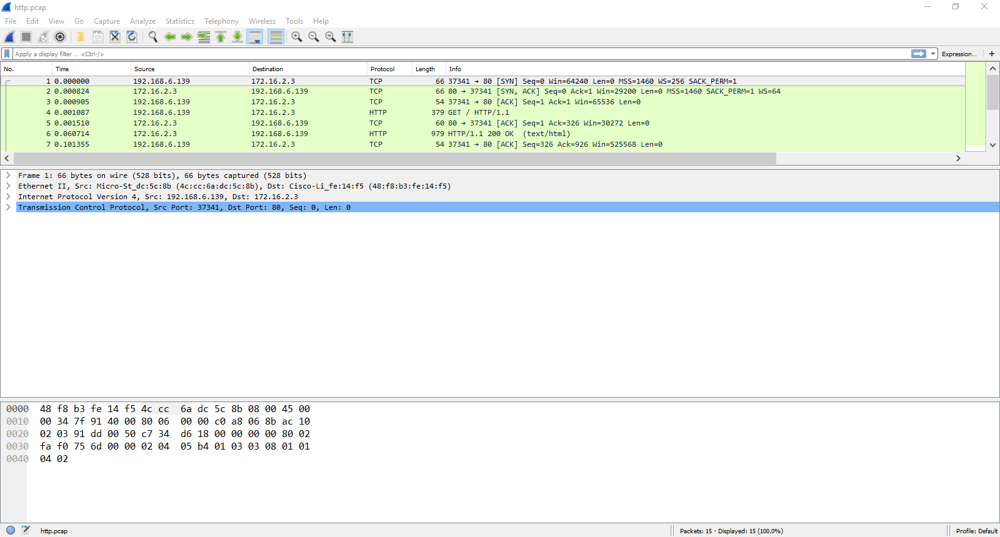
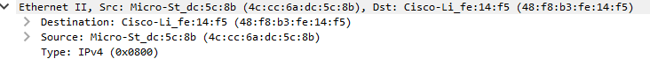
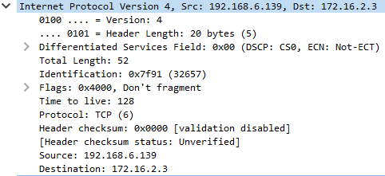
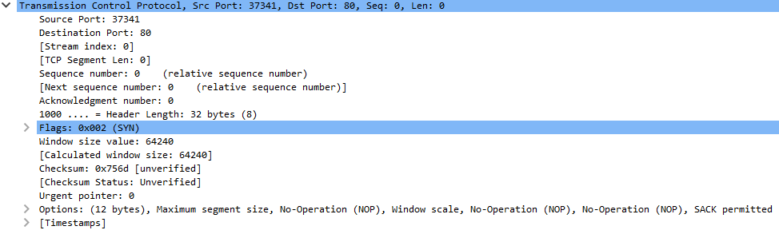

# 1. The Basics

This section is for learning (or brushing up) on the networking essentials terms and ideas you need. 

# What You'll Learn

* The OSI Model 
* The different layers of network communications 
* IP Addresses 
* TCP and UDP 
* Network Ports 

# The OSI Model

To make networking more modular and (perhaps) easier to understand, networking is broken up into layers. Each layer has a particular role to play in the networking process.

(By MichelBakni - Own work, CC BY-SA 4.0, [Source](https://commons.wikimedia.org/w/index.php?curid=66641106))

This is the OSI model probably the most commonly used model. The OSI has 7 layers, but we mostly care about the bottom 4 (Transport, Network, Data Link, Physical). Having layers allow different protocols to manage different parts of the communication process and be interchangeable. 

> For example, at layer 1, we could use optical (fiber) or copper cables (CAT5 Ethernet cables). At layer 2, we could use the protocols for 802.11 (wireless) or Ethernet (wired). 

This is all without changing any other layer. The OSI model helps to encourage the abstraction of components so we can swap things out without messing every other layer up.

Each layer has its own encapsulation or packaging. The data starts at the top and is packed in more and more layer information until it is sent. The layer information is used to move the data to its destination with different layers helping at different stages of the communication process.

# Seeing Network Communications 

A tool commonly used to view network traffic as it enters and leaves a system is Wireshark. It's usually referred to as a packet sniffer. It has a commandline-based cousin called `tcpdump`. Packet sniffers are usefully for see everything that's coming in or out of a system.

Wireshark gives us a nice interface, and displays the packet chopped up into layers. We'll use this to visualize network traffic to learn about the layers. If you want, you can download Wireshark [(Download from their site for Windows)](https://www.wireshark.org/), install it (use your package manager if you're on Linux), and download [this pcap](data/http.pcap) (it stores packet capture data). You should be able to double-click the pcap once Wireshark is installed to open it.

Once you open it, it should look similar to the screenshot below.

The top is a list of packets. Click one to view details about it. The details and the layer sections appear in the middle. Click the arrows on the left to get more details on each section. The bottom of the screen is the raw bytes. 

!!! note

    Keep your Wireshark open for the next section to visualize what's in each layer.

# The Layers

Now we'll step through each layer and detail its role in network communications. 

## Physical Layer

This is the stuff we actually send on. This is usually a cable or wireless signals that carry the data from point A to point B. When a system is virtualized, the physical networking layer is virtualized as well.

## Data Link Layer

One of the most common protocols you'll find here is Ethernet. In Wireshark, this is the second section from the top section. It should say `Ethernet II`. The main thing we'll focus on here is the two addresses marked by `Destination` and `Source`. These are MAC addresses. They are used to identify computers at layer 2. Layer 2 only cares about local communications between computers on the same network (for this, we'll be defining this as a collection of connected devices). It's kinda like apartment numbers. It's only relevant to a particular group. 

MAC addresses are assigned on the Ethernet hardware, so you don't usually have to worry about giving a computer a MAC address. (You can, however, change the MAC address or make new MAC addresses for virtual network interfaces) A switch device will use a MAC address to move frames (what the packaging at this layer is called) from once device to another.

The `Type` field is used to indicate what's in the next layer up in the Network layer.

!!! note

    The hardware device that commonly operates at this layer is the **switch**. It moves data around based on the MAC addresses and usually a center communication point for a single network. Thus it usually has a large number of interfaces on it.

## Network Layer

The next section down in Wireshark is layer 3, the Network layer. The protocol that is almost exclusively used here is the Internet Protocol (IP)... protocol. There's two versions, IPv4, which uses addresses like `192.168.122.1`, and IPv6, which uses addresses like `FE80:0000:0000:0000:0202:B3FF:FE1E:8329` (Try memorizing that!) IPv4 is the most common (and easiest to remember). IPv6 was/is supposed to replace IPv4, as it has many many many more addresses you can use, but IPv4 is still the most common. You'll meet up with IPv4 most often, but don't ignore IPv6! It's still usable, and many commands have IPv6 versions. (Systems will usually give themselves a IPv6 address derived from the MAC address) The source and destination addresses are in the `Destination` and `Source` fields.

Layer 3 only cares about end-to-end communications, kinda like a street address. Similar to sending a letter around the world (or next door) with a street address, IP addresses can be used to send across the world (or the network next door). 

!!! note

    The hardware device that commonly operates at this layer is the **router**. It moves data around based on the IP addresses and moves data between networks. Thus is usually has only a handful of interfaces on it.

IPv4 addresses are the ones you'll be setting a lot and be messing around with the most. So we have a dedicated section to them.

### IPv4 Addresses

IP addresses are divided into octets (this is because there are 8 binary digits per section): `<octect>.<octect>.<octect>.<octect>`. The biggest number that can go in the octet is `255` (the biggest number 8 binary digits can represent). 

When using an IP addresses on a computer or network device, its always paired with what's called a subnet mask. This subnet mask is not sent with the data, but used by devices as a guide. Subnet masks are used by devices to determine what's in their local network and what's not. They usually look something like this: `255.255.255.0` (similar to an IP address) or in "slash notation" `/24` (also known as a network prefix too). This number is the total number of bits in the subnet mask 

> Remember each section has 8, so `8 + 8 + 8 = 24`. 

The number of bits in a subnet mask can be increased and decreased to make the local network bigger or smaller in a process called _subnetting_. We won't get into subnetting here, it's a bit complicated, but it helps to make big networks for lots of devices or tiny networks if you're just connecting two devices (like routers) together. (If your interested, there's plenty of resources online.) 

There are two special addresses in a local network. The first address numerically (the `.0` when using `/24`) is reserved to represent the entire network as the "network address". Don't assign it to a device. The second address is the "broadcast address." This is the last address (`.255`) and it is used to send to everybody on the local network. Also do not assign this address to a device.

!!! warning

    Just remember that the first and last address are always unusable!

There's also another special address, `255.255.255.255`. This is the broadcast address of everything and any network. If this is the destination address, then its basically addressed to everybody! Don't assign this address to any device.

## Transport Layer

The next layer is the Transport Layer. It doesn't have addresses, but is used to identify what service the data is destined for. This layer also manages how the whole data arrives. There are two main protocols for this layer, `TCP` and `UDP`. Our example uses `TCP`. 

### TCP

TCP ensures two sides are talking and the data arrives intact and in the right order. It uses the "three-way-handshake" (the first three lines in Wireshark is this handshake) to negotiate the connection. 

(By N-21 - Own work, CC BY-SA 3.0, [Source](https://commons.wikimedia.org/w/index.php?curid=7972116))

TCP has flags to indicate the state of the connection. A sender sends a packet with a SYN flag, and gets a packet with the flags SYN and ACK (acknowledgment) set. A packet with ACK is sent in response to complete the handshake. 

TCP uses sequence numbers to keep things in order, with packets sent with ACK flag set to acknowledge data up to a certain point has been received. When its done, TCP uses another handshake (the last four lines in Wireshark) with FIN (finished) and ACK flags to tell each side they are done.

### UDP

The other protocol, `UDP` is much easier. It doesn't care if a connection is made and essentially just sends the data without bothering to check if it gets there.

That's it.

### Ports

Ports are used by both TCP and UDP to determine what service data is destined for. (e.g. is the data for a web server? a mail server?) Services will reserve "listening" on a port, waiting for data destined for that port. Both ends will have a port. Services, like web servers, listen on "well-known" ports that have been assigned to that type of servive. For example, web servers listen on port 80 (You can see this in the Wireshark above as the `Destination Port`). The port of the sender is usually randomized from ports of a higher port number (maybe something between 32768 or 61000, the Wireshark image above has port `37341`) and identifies the sending program in the response.

!!! note

    On most systems, using ports below 1024 requires admin privileges.

### Session, Presentation, and Application

Most of the time, these layers are sort of globed together. In these layers you'll find protocols for particular applications, such as HTTP (for web services), SSH ( for remote management), and SMTP (for email). These protocols might be layered with encryption, like HTTPS, where it's HTTP except the data is encrypted, or encryption might be built into the protocol, like SSH. Things like user sessions are managed in these layers too, but it's not entirely clear which of the three layers manages it entirely.

We won't go into detail on these protocols, as most are much more complex and would take too long to explain. A quick search on the internet usually can get you high-level as well as detailed descriptions of how a particular protocol works.

## Next Steps

If you want to try to put some of these knowledge to use, try the [Networking Basics Tutorial](../tutorials/Networking-Basics/1-Getting-Set-Up.md) on the [Nettux VM](../getting-nettux.md). This will show you how to configure a small network and help you start thinking the "network" way. Networking can be difficult, as it doesn't normally give you logs or error messages when something is wrong. Hopefully, with practice and the other [tutorials](../tutorials/index.md) on this site, you can become a confident network operator in no time!

If you want to learn more of the networking terms, you can look at the [Linux Terms](./2-Linux-Terms.md) and [General Terms](./3-General-Terms.md) lists.