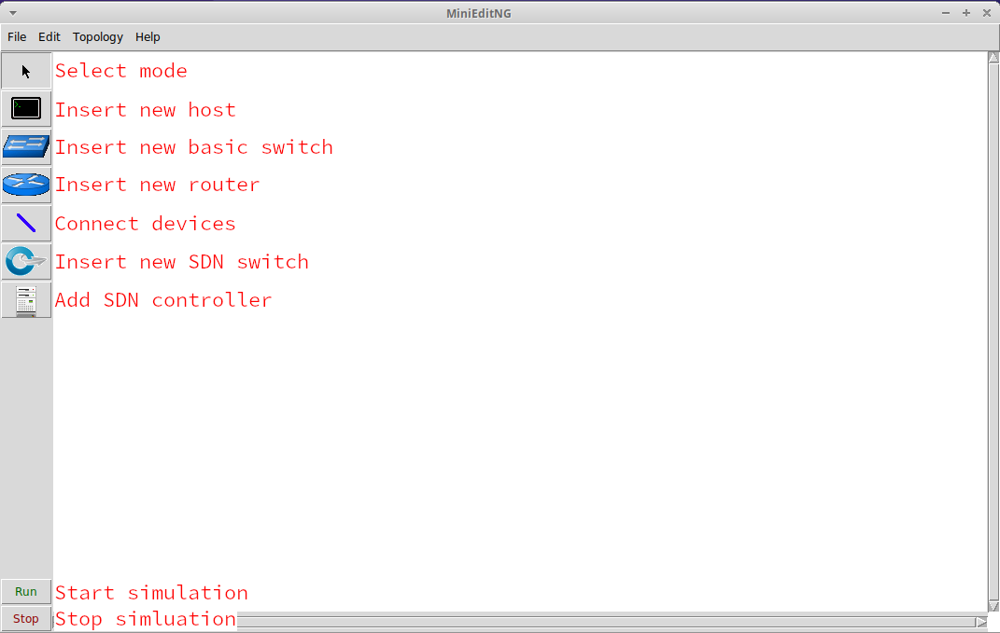

# MiniEditNG

MiniEditNG is a rework of the original MiniEdit in the Mininet project. It has a few quality-of-life improvements to make it easier to use.

You can find MiniEditNG by using the application menu `Internet > MiniEditNG` or running `sudo minieditng`.

## sudo Privileges

Note that regardless of how you start MiniEditNG, you will need to run as root. The application shortcut brings up a terminal with the sudo prompt ready for you. Be sure to keep that terminal window open.

## UI Overview

MiniEditNG provides a GUI interface to build topologies of virtual hosts, switches, and routers using the [Mininet project](https://mininet.org/). Using network namespaces and [Open vSwitch](https://www.openvswitch.org/), Mininet creates a simulated network that can run real applications and protocols.

## Creating a Topology

!!! note

    The hosts, switches, and routers won't exist until the simulation is started.

### Adding Systems

To add systems to the current topology, select one of the system types on the left toolbar. Click to place.

### Connecting Systems

To connect systems, select the "NetLink" on the left. Click the source system, then drag over to the system you want to connect to.

!!! note

    Hosts cannot be directly connected to other Hosts.

## Start and Stopping the Simulation

### Start

Pressing the "Run" button on the bottom left of the screen will build and start the systems in the topology. The background of the topology will turn grey to indicate this. While you can move objects around, you will not be able to add or remove any systems until the simulation is stopped.

### Stop

!!! warning

    Stopping the simulation destroys all switches and systems. Modifications to these will be lost!

Pressing the "Stop" button on the bottom left of the screen will delete all switches and destroy all systems in the topology. Any unsaved changes will be lost and nay processes running in the system's network namespaces

## Option Menus

Right-clicking on systems shows a dropdown menu. This will change based on whether the simulation is running or not.

