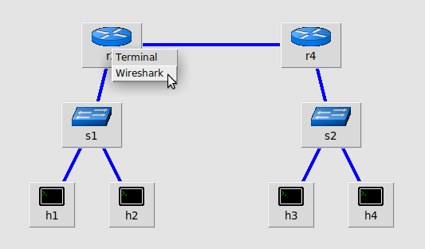

# Packet Capturing

Nettux has both `tcpdump` and Wireshark installed on it. 

## Wireshark

Wireshark is a well-known packet capture application, having GUI and CLI clients.

## tcpdump

tcpdump is a command-line tool to do packet capture and replay. Its filter system works a bit differently from Wireshark as has a number of different flags.

tcpdump Resources:

- [https://www.tcpdump.org/manpages/pcap-filter.7.html](https://www.tcpdump.org/manpages/pcap-filter.7.html)
- [https://www.redhat.com/sysadmin/filtering-tcpdump](https://www.redhat.com/sysadmin/filtering-tcpdump)
- [https://www.stationx.net/tcpdump-cheat-sheet/](https://www.stationx.net/tcpdump-cheat-sheet/)


## Capturing in a Network Namespace

Capturing inside a network namespace, whether that be a Mininet host/router or a nshost built with the scripts, you simply need to run your command in the namespace.

For example, to run tcpdump in an nshost:

``` bash
nettux@nettux:~$ sudo nshost-shell HOST
(HOST) root@nettux:/home/nettux# tcpdump -i any -nvv -l
tcpdump: data link type LINUX_SLL2
tcpdump: listening on any, link-type LINUX_SLL2 (Linux cooked v2), snapshot length 262144 bytes
21:56:27.074959 l-c-0 In  IP (tos 0x0, ttl 64, id 19863, offset 0, flags [DF], proto ICMP (1), length 84)
    192.168.70.1 > 192.168.70.2: ICMP echo request, id 45954, seq 29, length 64
21:56:27.075050 l-c-0 Out IP (tos 0x0, ttl 64, id 557, offset 0, flags [none], proto ICMP (1), length 84)
    192.168.70.2 > 192.168.70.1: ICMP echo reply, id 45954, seq 29, length 64
21:56:28.104102 l-c-0 In  IP (tos 0x0, ttl 64, id 20063, offset 0, flags [DF], proto ICMP (1), length 84)
    192.168.70.1 > 192.168.70.2: ICMP echo request, id 45954, seq 30, length 64
21:56:28.104135 l-c-0 Out IP (tos 0x0, ttl 64, id 603, offset 0, flags [none], proto ICMP (1), length 84)
    192.168.70.2 > 192.168.70.1: ICMP echo reply, id 45954, seq 30, length 64
21:56:29.120992 l-c-0 In  IP (tos 0x0, ttl 64, id 20066, offset 0, flags [DF], proto ICMP (1), length 84)
    192.168.70.1 > 192.168.70.2: ICMP echo request, id 45954, seq 31, length 64
21:56:29.121024 l-c-0 Out IP (tos 0x0, ttl 64, id 641, offset 0, flags [none], proto ICMP (1), length 84)
    192.168.70.2 > 192.168.70.1: ICMP echo reply, id 45954, seq 31, length 64
```

MiniEditNG also has a option in a host or router's dropdown menu to start Wireshark in that system's network namespace. The following will start a Wireshark in r3's namespace.

!!! note

    Opening Wireshark is only available when the simulation is running.

