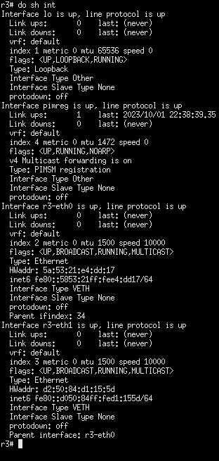

# RIPv2 Network

RIPv2 is a classful distance-vector internal routing protocol. It uses a hop-count to determine the best router to a destination, and is fairly simple. It sends out its routing table to other routers to spread routes. However, this can be inefficient on larger networks. Combined with the hop limit of 16, this means only smaller networks are practical for use with RIPv2.

## Opening a New Topology

To speed up getting started, we'll use a pre-built topology in MiniEditNG. To open the topology, in MinieditNG go to `File > Open Topology`


Then browse to the path `/opt/topologies/`. And select `double-network.mn`


Then click "Open" to open the topology.


## Starting the Simulation

Since we don't need to edit the topology, let's immediately start the simulation. Click the "Run" button on the bottom left.


## Accessing and Configuring Router r3

Let's configure r3 first. Right click to bring up it's dropdown menu and select "Terminal".


Then run the following commands to initialize and start the router processes for r3:

``` shell
root@nettux:/home/nettux# router-init r3
root@nettux:/home/nettux# router-start r3
```


We can then edit the router's configuration with the vtysh shell:

``` shell
root@nettux:/home/nettux# router-shell r3
```

!!! note

    This shell imitates Cisco's IOS shell, so if you're familiar with it, you'll feel right at home.

Let's view the interfaces with `sh ip int`. (Yours might be a bit different)



To identify what interface goes where, you can mouse-over the connection between systems to view the interfaces. 

!!! warning

    Interfaces may not appear in the direction the systems are in the topology. Use the hostname prepended to the interface name to match the correct host and interface.

!!! note

    Sometimes the interface names may appear under system icons. You may need to move systems around or try mousing-over at a different spot.


Use the following commands to configure your interfaces. Note that in this case, `r3-eth1` connects to r4, and `r3-eth0` connects to s1. Adjust if your topology produces different interface names.

```
r3# config
r3(config)# int r3-eth1
r3(config-if)# ip add 10.10.15.1/30
r3(config-if)# exit
r3(config)# int r3-eth0
r3(config-if)# ip add 192.168.90.1/24
r3(config-if)# exit
```

## Accessing and Configuring Router r4

To configure r4, follow the same process. Right click r4, select "Terminal", then run:

```
root@nettux:/home/nettux# router-init r4
root@nettux:/home/nettux# router-start r4
root@nettux:/home/nettux# router-shell r4
```

Then in the vtysh configure the interfaces. Note that in this case, `r4-eth0` connects to r3, and `r3-eth1` connects to s2. Adjust if your topology produces different interface names.

```
r4# config
r4(config)# int r4-eth0
r4(config-if)# ip addr 10.10.15.2/30
r4(config-if)# exit
r4(config)# int r4-eth1
r4(config-if)# ip addr 172.16.5.1/24
r4(config-if)# exit
```

You should be able to ping r3 from r4 now (Use exit to exit interface (`config-if`) or config (`config`) modes):

```
r4(config)# exit
r4# ping 10.10.15.1
PING 10.10.15.1 (10.10.15.1) 56(84) bytes of data.
64 bytes from 10.10.15.1: icmp_seq=1 ttl=64 time=0.067 ms
64 bytes from 10.10.15.1: icmp_seq=2 ttl=64 time=0.083 ms
^C
--- 10.10.15.1 ping statistics ---
2 packets transmitted, 2 received, 0% packet loss, time 1023ms
rtt min/avg/max/mdev = 0.067/0.075/0.083/0.008 ms
r4# 
```

or run with `do`:

```
r4(config)# do ping 10.10.15.1
PING 10.10.15.1 (10.10.15.1) 56(84) bytes of data.
64 bytes from 10.10.15.1: icmp_seq=1 ttl=64 time=0.133 ms
64 bytes from 10.10.15.1: icmp_seq=2 ttl=64 time=0.030 ms
^C
--- 10.10.15.1 ping statistics ---
2 packets transmitted, 2 received, 0% packet loss, time 1022ms
rtt min/avg/max/mdev = 0.030/0.081/0.133/0.051 ms
r4(config)# 
```

## Configuring Host h1

To configure Host h1, right click show its dropdown menu.


You'll configure this using the normal Linux `ip` command, since this isn't a router system.

```
root@nettux:/home/nettux# ip addr add 192.168.90.5/24 dev h1-eth0 
```


Note that in the image, Mininet has assigned a default address to h1 of 10.0.0.1/8. Remove it with the following command.

```
root@nettux:/home/nettux# ip addr del 10.0.0.1/8 dev h1-eth0 
```


Also add the default gateway to h1 with the following command:
```
root@nettux:/home/nettux# ip route add default via 192.168.90.1
```

You should be able to now ping `10.10.15.1`, the interface on r3 connected to r4, but not the address `172.16.5.1` on r4. We need r4 to distribute routes for this network.

```
root@nettux:/home/nettux# ping 10.10.15.1
PING 10.10.15.1 (10.10.15.1) 56(84) bytes of data.
64 bytes from 10.10.15.1: icmp_seq=1 ttl=64 time=0.689 ms
^C
--- 10.10.15.1 ping statistics ---
1 packets transmitted, 1 received, 0% packet loss, time 0ms
rtt min/avg/max/mdev = 0.689/0.689/0.689/0.000 ms
root@nettux:/home/nettux# ping 172.16.5.1
PING 172.16.5.1 (172.16.5.1) 56(84) bytes of data.
From 192.168.90.1 icmp_seq=1 Destination Net Unreachable
From 192.168.90.1 icmp_seq=2 Destination Net Unreachable
^C
--- 172.16.5.1 ping statistics ---
2 packets transmitted, 0 received, +2 errors, 100% packet loss, time 1040ms

root@nettux:/home/nettux#
```

`From 192.168.90.1 icmp_seq=1 Destination Net Unreachable` indicates that r3 doesn't know what to do with the data and is being kind enough to tell us it can't route it.

## Packet Capture

Let's start Wireshark on r4 to see when r3 starts sending RIPv2 traffic. To do this, right-click r4 and select "Wireshark". Note it might take a second for Wireshark to open. Once this is done, double-click the interface connected to r3 (in our case `r4-eth0`) and the capture will begin. 

## Configuring RIPv2 on r3

Back in the vtysh on r3, run the following commands:

```
r3(config)# router rip
r3(config-router)# version 2
r3(config-router)# network 192.168.90.1/24
r3(config-router)# network 10.10.15.0/30
r3(config-router)# 
```

`version 2` ensures that the RIP process only uses v2 packets and not v1 packets. `network <NETWORK>` tells the RIPv2 process to distribute on and about these networks as well as accept RIPv2 packets coming from these networks. If we go back to Wireshark on r4, we can see RIPv2 traffic arriving. (You can type `rip` into the filter bar at the top and press enter to view only RIP traffic.) Click on the captured packet so can view its details in hhe bottom portion of the Wireshark interface.


## Configuring RIPv2 on r4 

However, since r4 is not configured to run RIPv2 and no networks are configured on r4, nothing has changed on r4's routing table:

```
r4# sh ip route
Codes: K - kernel route, C - connected, S - static, R - RIP,
       O - OSPF, I - IS-IS, B - BGP, E - EIGRP, N - NHRP,
       T - Table, v - VNC, V - VNC-Direct, A - Babel, F - PBR,
       f - OpenFabric,
       > - selected route, * - FIB route, q - queued, r - rejected, b - backup
       t - trapped, o - offload failure

C>* 10.10.15.0/30 is directly connected, r4-eth0, 00:20:03
C>* 172.16.5.0/24 is directly connected, r4-eth1, 00:19:51
```

To configure RIPv2 on r4, run the following commands:

```
r4# config
r4(config)# router rip
r4(config-router)# version 2
r4(config-router)# network 10.10.15.0/30
r4(config-router)# network 172.16.5.0/24
```

RIPv2 periodically sends updates about its routing table, so it may take a few seconds for the routing tables to sync up or "converge." Check the routing table after a few seconds. The RIP routes should now be visible in the routing table:

```
r4# sh ip route
Codes: K - kernel route, C - connected, S - static, R - RIP,
       O - OSPF, I - IS-IS, B - BGP, E - EIGRP, N - NHRP,
       T - Table, v - VNC, V - VNC-Direct, A - Babel, F - PBR,
       f - OpenFabric,
       > - selected route, * - FIB route, q - queued, r - rejected, b - backup
       t - trapped, o - offload failure

C>* 10.10.15.0/30 is directly connected, r4-eth0, 00:25:17
C>* 172.16.5.0/24 is directly connected, r4-eth1, 00:25:05
R>* 192.168.90.0/24 [120/2] via 10.10.15.1, r4-eth0, weight 1, 00:01:42
r4# 
```

## Testing on h1

You should now be able to ping 172.16.5.1 (on r4) from h1.

```
root@nettux:/home/nettux# ping 172.16.5.1
PING 172.16.5.1 (172.16.5.1) 56(84) bytes of data.
64 bytes from 172.16.5.1: icmp_seq=1 ttl=63 time=0.368 ms
64 bytes from 172.16.5.1: icmp_seq=2 ttl=63 time=0.080 ms
^C
--- 172.16.5.1 ping statistics ---
2 packets transmitted, 2 received, 0% packet loss, time 1011ms
rtt min/avg/max/mdev = 0.080/0.224/0.368/0.144 ms
root@nettux:/home/nettux# 
```

## Further Tasks

Configure the other hosts connected to s1 and s2 with IPs that fit the local network. Make sure you can ping from both sides of the network.