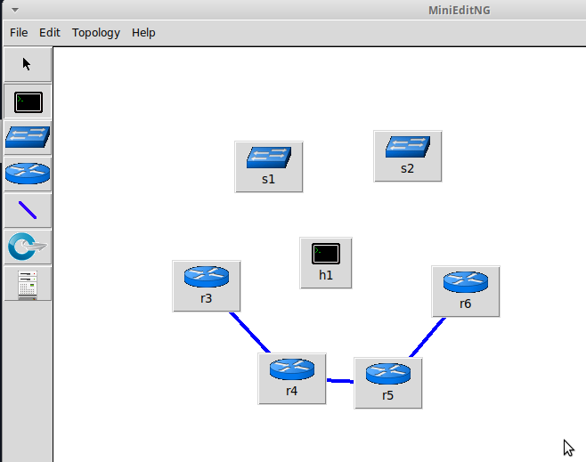
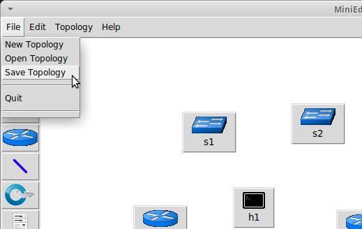
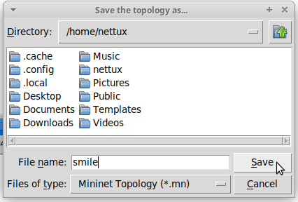
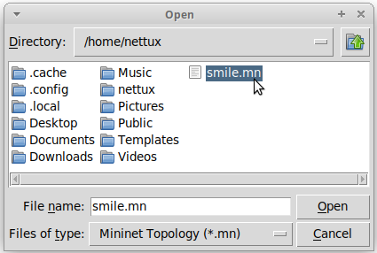

# Saving and Loading

## Saving a Topology

Let's say you have a beautiful topology you want to save in MiniEditNG.

Select `File > Save Topology`.

In the dialog, navigate to where you want to save (probably the home directory `/home/<USER>`) and where you have permissions. Then press "Save".

## Loading a Topology

To load a topology in MinieditNG, go to `File > Open Topology`

In the dialog, navigate to the directory containing the `.mn` file with the topology you want.

Then press "Open" to open the topology.